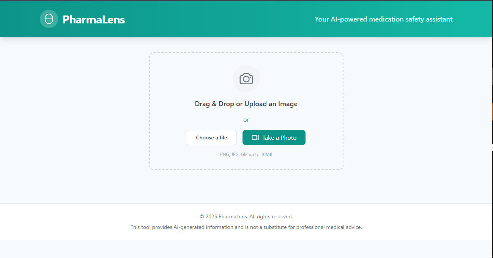
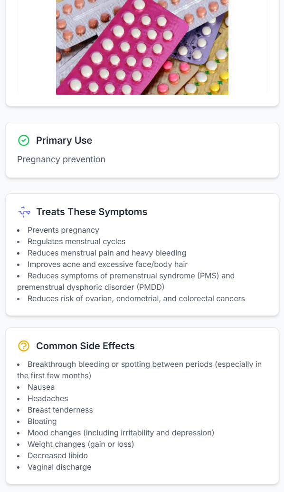

# PharmaLens: AI-Powered Medication Identification & Safety

PharmaLens is a web-based application designed to combat the proliferation of counterfeit medications and improve health literacy in Africa. By allowing users to simply take a picture of a medication, PharmaLens provides immediate, life-saving information about its use, side effects, and critical warnings. 

[Link to Live Demo](#)  
*Desktop View*

---

## Technology Stack

PharmaLens is built with a modern, scalable technology stack:

-   **Frontend**: A responsive web application built with **React** and **TypeScript**.
-   **Core AI Model**: **Google's Gemini 2.5 Flash**, a powerful, multimodal large language model accessed via the **Google AI API (Vertex AI)**.
-   **Deployment**: Hosted on **Firebase Hosting** for reliable and scalable delivery.

---

## Features

-   **Image-Based Analysis**: Upload a photo of a pill or its packaging for instant identification.
-   **Comprehensive Information**: Get structured details on the medication's name, primary use, active ingredients, and dosage.
-   **Critical Safety Warnings**: See prominent alerts for severe reactions, drug interactions, and contraindications.
-   **User-Friendly Interface**: Information is presented in easy-to-read cards with clear icons, designed for all literacy levels.
-   **Responsive Design**: The application is fully functional on both mobile and desktop browsers.

---

## Showcase

Here's a glimpse of PharmaLens in action.

### Main Interface

The clean and intuitive interface allows users to easily upload an image or take a new photo. The design is fully responsive and works seamlessly on both desktop and mobile devices.


*Mobile View*


### Live Analysis in Action

Watch this short video demonstrating the real-time analysis process:

<video src="assets/video illutration.webm" width="100%" controls autoplay loop muted>
  Your browser does not support the video tag.
</video>

### Example Results

Once an image is analyzed, PharmaLens presents the information in a clear and organized manner.

*Ibuprofen Analysis*


*Birth Control Analysis*


---

## Getting Started

Follow these instructions to set up and run the project on your local machine for development and testing purposes.

### Prerequisites

Make sure you have the following software installed on your machine:

-   **Node.js**: Version 20.x or later. You can download it from [nodejs.org](https://nodejs.org/).
-   **npm**: Node Package Manager (comes with Node.js).
-   **Firebase CLI**: Google's command-line tool for managing Firebase projects. Install it globally with npm:
    ```bash
    npm install -g firebase-tools
    ```

### 1. Clone the Repository

First, clone the project repository to your local machine:

```bash
git clone https://github.com/secbyteX03/PharmaLens.git
cd PharmaLens
```

### 2. Install Dependencies

Install the required npm packages for the project:

```bash
npm install
```

### 3. Configure Your Gemini API Key

The application requires a Google Gemini API key to function. 

1.  **Get an API Key**: Obtain your API key from the [Google AI for Developers](https://ai.google.dev/) website.
2.  **Create a Configuration File**:
    -   In the `public` directory, create a new file named `config.js`.
    -   Add the following line to `public/config.js`, replacing `\"YOUR_API_KEY_HERE\"` with your actual key:
        ```javascript
        window.GEMINI_API_KEY = \"YOUR_API_KEY_HERE\";
        ```

    *This file is already listed in `.gitignore` to ensure your API key is not accidentally committed to the repository.*

---

## Running the Application Locally

Once the setup is complete, you can run the React development server:

```bash
npm start
```

This will automatically open the application in your default web browser at **`http://localhost:3000`**.

The page will reload if you make edits to the source code.

---

## Deployment to Firebase Hosting

Follow these steps to deploy the application to a live URL.

### 1. Set Up a Firebase Project

-   Go to the [Firebase Console](https://console.firebase.google.com/).
-   Click **"Add project"** and follow the on-screen instructions to create a new project.
-   Once the project is. created, navigate to the **Hosting** section from the side menu and click **"Get started"**.

### 2. Log in to Firebase

Authenticate the Firebase CLI with your Google account:

```bash
firebase login
```

### 3. Initialize Firebase in Your Project

If your local project directory hasn't been initialized for Firebase yet, run the following command:

```bash
firebase init hosting
```

Follow the prompts:
-   **What do you want to use as your public directory?** Enter `build`.
-   **Configure as a single-page app (rewrite all urls to /index.html)?** Enter `Yes`.
-   **Set up automatic builds and deploys with GitHub?** Enter `No` for now.

This will create `firebase.json` and `.firebaserc` files in your project.

### 4. Build the Application

Create an optimized, production-ready build of the React application:

```bash
npm run build
```

This command will create a `build` folder with all the static assets for your application.

### 5. Deploy to Firebase

Finally, deploy the contents of the `build` folder to Firebase Hosting:

```bash
firebase deploy --only hosting
```

After the command finishes, the CLI will output your live site URL(s).

---

## Project Structure

```
PharmaLens/
├── public/             # Contains the main HTML file and config.js
├── src/
│   ├── components/     # Reusable React components (Uploader, Results, etc.)
│   ├── hooks/          # Custom React hooks (e.g., useGemini.ts)
│   ├── types/          # TypeScript type definitions
│   ├── App.tsx         # Main application component
│   ├── index.css       # Global styles
│   └── index.tsx       # Application entry point
├── .gitignore          # Files to be ignored by Git
├── firebase.json       # Firebase configuration
├── package.json        # Project dependencies and scripts
└── README.md           # This file
```

---

## License

This project is licensed under the MIT License. See the [LICENSE](LICENSE) file for details.
